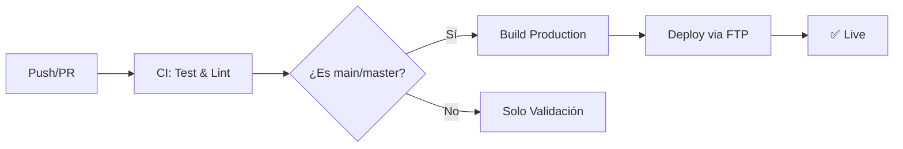

# 🚀 Deployment Configuration

## GitHub Actions Setup

Este proyecto utiliza GitHub Actions para deployment automático. Aquí está la configuración necesaria:

### 📋 Secrets Requeridos

Ve a tu repositorio en GitHub → Settings → Secrets and variables → Actions y agrega estos secrets:

#### 📧 EmailJS Configuration
```
VITE_EMAILJS_SERVICE_ID=your_service_id_here
VITE_EMAILJS_TEMPLATE_ID=your_template_id_here  
VITE_EMAILJS_PUBLIC_KEY=your_public_key_here
```

#### 🔐 FTP Credentials (para Namecheap)
```
FTP_HOST=your_domain.com (ej: fernandocueto.com)
FTP_USERNAME=your_cpanel_username
FTP_PASSWORD=your_cpanel_password
```

### 🔄 Workflows Disponibles

#### 1. **CI (Continuous Integration)** - `.github/workflows/ci.yml`
- ✅ Se ejecuta en **todos los pushes** y **PRs**
- 🔍 Ejecuta linting y verificaciones de formato
- 🏗️ Prueba que el build funcione
- 🔒 Ejecuta auditoría de seguridad

#### 2. **Deploy** - `.github/workflows/deploy.yml`
- 🚀 Se ejecuta **solo en pushes a main/master** o **PRs aprobados**
- 📦 Construye la aplicación para producción
- 🌐 Despliega automáticamente vía FTP a tu hosting

### 🎯 Flujo de Trabajo



### 📝 Eventos que Activan Deployment

1. **Push directo a main/master**
   ```bash
   git push origin main
   ```

2. **PR aprobado y mergeado a main/master**
   ```bash
   # Después de aprobar y mergear PR
   ```

### 🔧 Configuración de FTP para Namecheap

1. **Obtener credenciales FTP:**
   - Ve a cPanel → File Manager
   - O usa las credenciales de cPanel directamente

2. **Host FTP:**
   - Generalmente es tu dominio: `fernandocueto.com`
   - O la IP del servidor que te proporciona Namecheap

3. **Directorio de destino:**
   - `/public_html/` (configurado en el workflow)

### 🚨 Troubleshooting

#### Error de FTP Connection
```yaml
# Verifica que tengas los secrets correctos:
FTP_HOST=tu_dominio.com (sin http://)
FTP_USERNAME=usuario_cpanel
FTP_PASSWORD=contraseña_cpanel
```

#### Error de Build
```yaml
# Verifica las variables de EmailJS:
VITE_EMAILJS_SERVICE_ID=service_xxxxxxx
VITE_EMAILJS_TEMPLATE_ID=template_xxxxxxx
VITE_EMAILJS_PUBLIC_KEY=xxxxxxxxxxxxxxx
```

### 📊 Monitoreo

- **Actions tab** en GitHub para ver logs
- **Email notifications** (configurables en GitHub)
- **Status badges** (opcional)

### 🔄 Rollback Manual

Si necesitas hacer rollback:

1. **Revertir commit:**
   ```bash
   git revert HEAD
   git push origin main
   ```

2. **Deploy manual:**
   ```bash
   npm run build:production
   # Subir dist/ manualmente via FTP
   ```

### 📈 Optimizaciones Futuras

- [ ] Cache de node_modules más agresivo
- [ ] Notificaciones por email/Slack
- [ ] Preview deployments para PRs
- [ ] Tests automatizados
- [ ] Lighthouse CI para performance

---

💡 **Tip**: Después de configurar los secrets, haz un push pequeño para probar que todo funciona correctamente.
